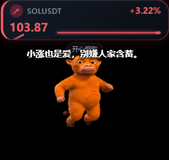
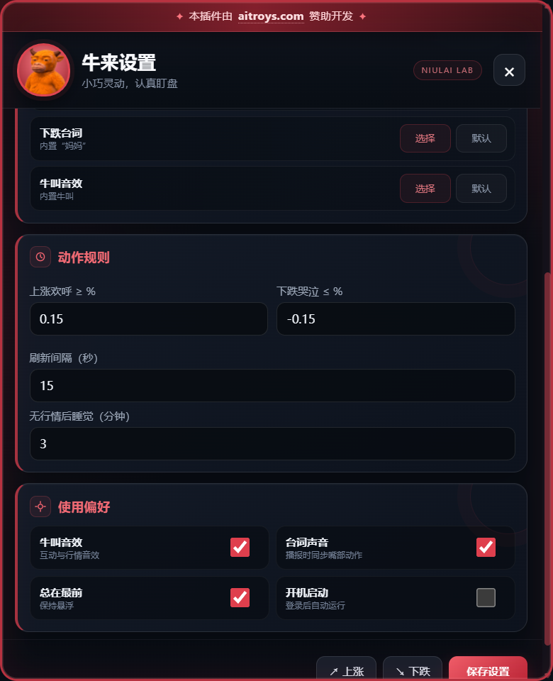

<p align="center">
  
</p>

<h1 align="center">牛来行情桌宠</h1>

<p align="center">会看盘、会喊话、会跑动，也会在休市时睡觉的轻量桌面宠物。</p>

Windows / macOS 轻量行情桌面宠物，使用 Wails 和系统 WebView2/WebKit。运行时只加载压缩后的 2D/2.5D 多帧图集，不携带 Electron、3D 模型或本地生成模型。

## 程序预览

| 桌面宠物与行情播报 | 设置界面 |
| --- | --- |
|  |  |

## 功能

- A 股指数、自定义 A 股股票、数字货币 USDT 交易对及自定义 HTTPS JSON API。
- 默认东张西望；上涨时喊“牛来”并沿平滑随机路线奔跑；下跌时喊“妈妈”并蹲下哭泣。
- A 股午间休市、收盘或长时间无行情时睡觉，双击宠物可唤醒。
- 可拖拽、可切换小/中尺寸、关闭音效、替换三类声音、控制阈值和轮询间隔。
- 行情数字平滑变化，涨跌颜色联动；字幕采用透明背景并自动完整换行。

## 下载与安装

请在 GitHub Releases 下载对应文件：

- Windows 安装版：`Niulai-Pet-Windows-amd64-setup.exe`
- Windows 便携版：`Niulai-Pet-Windows-amd64-portable.exe`
- macOS 安装镜像：`Niulai-Pet-macOS-universal.dmg`
- macOS 应用压缩包：`Niulai-Pet-macOS-universal.zip`

macOS 包目前为无 Apple Developer ID 的个人使用构建。首次启动若被 Gatekeeper 拦截，请在 Finder 中右键应用并选择“打开”；不要直接双击第一次启动。

## 配置

所有选项都可以在桌宠的“设置”窗口完成，无需手工编辑文件。配置文件位置、字段说明、自定义行情接口示例和自定义声音说明见 [CONFIGURATION.md](CONFIGURATION.md)。

程序不会把用户填写的自定义 API 请求头提交到本仓库。可用时，请求头会存入 Windows 凭据管理器或 macOS 钥匙串。

## 本地构建

要求 Go 1.23、Node.js 22、Wails CLI 2.10.2。Windows 安装包还需要 NSIS。

```powershell
# Windows
npm run dist:win
```

```bash
# macOS
cd frontend && npm ci && cd ..
go install github.com/wailsapp/wails/v2/cmd/wails@v2.10.2
npm run dist:mac
```

推送 `v*` 标签或手动运行 `Build and release desktop packages` 工作流，会在 GitHub Releases 同时发布 Windows 与 macOS 包。

## 隐私与素材

- 默认 A 股和数字货币行情使用公开接口，不要求 API Key。
- 自定义 API 只接受 HTTPS 地址。
- 电影音频及角色素材仅供权利人授权范围内的个人使用；分发前请自行确认拥有相应权利。

本插件由 [aitroys.com](https://www.aitroys.com/) 赞助开发。
